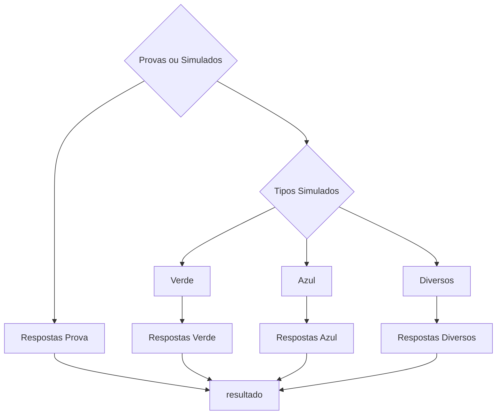

# Projeto de Automação para Correção  de Provas e Simulados Aplicando Técnicas de Visão Computacional

O projeto tem como objetivo o desenvolvimento de protótipo para automatizar o processo de leitura e correção de provas e simulados aplicando técnicas de visão computacional. Foram aplicadas técnicas de Classificação, Detecção, etc.


## Fluxo do Projeto

Segue abaixo a descrição detalhada do fluxo do projeto:
1. **Submissão de Imagem de Entrada:**
   - O processo inicia com a submissão de uma imagem, que pode ser uma prova ou gabarito.

2. **Modelo de Classificação `YOLOv8m-cls` (1º Modelo):**
   - A imagem é submetida ao primeiro modelo de classificação, `YOLOv8m-cls`.
   - Este modelo classifica entre "Prova" ou "Simulado".

3. **Caso: Prova (Classificado pelo 1º Modelo):**
   - Se a imagem for classificada como "Prova", o fluxo continua para o próximo passo.

4. **Modelo de Detecção `YOLOv8m` (2º Modelo):**
   - A imagem (prova) é submetida ao segundo modelo de detecção, `YOLOv8m`.
   - Este modelo detecta e retorna a questão marcada pelo usuário como resposta.

5. **Caso: Simulado (Classificado pelo 1º Modelo):**
   - Se a imagem for classificada como "Simulado", o fluxo se desvia para outra sequência de modelos.

6. **Modelo de Classificação `YOLOv8m-cls` para Tipos de Simulados (3º Modelo):**
   - A imagem (simulado) é submetida a um terceiro modelo de classificação, `YOLOv8m-cls`.
   - Este modelo classifica entre os 3 formatos de simulados existentes.

7. **Modelo de Detecção `YOLOv8m` para Simulados (4º Modelo):**
   - A imagem (simulado) é passada para um quarto modelo de detecção, `YOLOv8m`.
   - Este modelo retorna as questões marcadas pelo aluno no simulado.

### Resumo:
- O projeto começa com a classificação da imagem como "Prova" ou "Simulado" usando o `YOLOv8m-cls`.
- Se for uma prova, é aplicado o `YOLOv8m` para detectar a questão marcada.
- Se for um simulado, é feita uma nova classificação para determinar o tipo de simulado usando outro modelo `YOLOv8m-cls`.
- Em seguida, um segundo modelo `YOLOv8m` é utilizado para detectar as questões marcadas no simulado.

### Ilustração do Fluxo


## Informações de Treinamento
### Ambiente
Todos os modelos foram treinados utilizando o Google Colab.
### Modelos de Classificação

#### Modelo Provas ou Simulado

##### Parâmetros do Modelo

- **Tarefa (Task):** Classificação
- **Modo (Mode):** Treinamento
- **Modelo (Model):** YOLOv8m-cls.pt `pre-trained` 
- **Dados (Data):** Diretório "/content/gdrive/MyDrive/simulados" contendo as imagens de treinamento.
- **Épocas (Epochs):** 300.
- **Paciência (Patience):** 50.
- **Tamanho do Lote (Batch):** 16.
- **Tamanho da Imagem (Imgsz):** 224 pixels.
- **Aumento de Dados(Data Augmentation):** rotation: 5 and 10 degrees.
  
#### Modelo dos Simulados

##### Parâmetros do Modelo

- **Tarefa (Task):** Classificação
- **Modo (Mode):** Treinamento
- **Modelo (Model):** YOLOv8m-cls.pt `pre-trained`
- **Dados (Data):** Diretório "/content/gdrive/MyDrive/simulados" contendo as imagens de treinamento.
- **Épocas (Epochs):** 300.
- **Paciência (Patience):** 50.
- **Tamanho do Lote (Batch):** 16.
- **Tamanho da Imagem (Imgsz):** 224 pixels.
- **Aumento de Dados(Data Augmentation):** rotation: 5 and 10 degrees.

### Modelos de Detecção

### Parâmetros do Modelo para o Tipo verde
- **Tarefa (Task):** detecção 
- **Modo (Mode):** Treinamento
- **Modelo (Model):** yolov8m.pt `pre-trained`
- **Dados (Data):** Diretório "/content/gdrive/MyDrive/simulados" contendo as imagens de treinamento.
- **Épocas (Epochs):** 300.
- **Paciência (Patience):** 50.
- **Tamanho do Lote (Batch):** 16.
- **Tamanho da Imagem (Imgsz):** 640 pixels.
- - **Aumento de Dados(Data Augmentation):** rotation: 5 and 10 degrees.
  
- ### Parâmetros do Modelo para o Tipo Azul
- **Tarefa (Task):** detecção 
- **Modo (Mode):** Treinamento
- **Modelo (Model):** yolov8m.pt `pre-trained`
- **Épocas (Epochs):** 300.
- **Paciência (Patience):** 50.
- **Tamanho do Lote (Batch):** 16.
- **Tamanho da Imagem (Imgsz):** 640 pixels.
- **Aumento de Dados(Data Augmentation):** rotation: 5 and 10 degrees.
  
### Parâmetros do Modelo para o Tipo Diversos
- **Tarefa (Task):** detecção 
- **Modo (Mode):** Treinamento
- **Modelo (Model):** yolov8m.pt `pre-trained`
- **Épocas (Epochs):** 150.
- **Paciência (Patience):** 50.
- **Tamanho do Lote (Batch):** 16.
- **Tamanho da Imagem (Imgsz):** 640 pixels.
- **Aumento de Dados(Data Augmentation):** rotation: 5 and 10 degrees.

## Soluções Mobile

<p align="center">
  
  
</p>

<p align="center">
  
  
</p>


## Soluções Para windows

<a target="_blank" align="center">
  
</a>


  

## Configuração do modelo 


## Resultados do treinamento 

## Resultados do treinamento Modelo verde
<a target="_blank" align="center">
  
</a>


## matriz de confusão normalizada  Modelo verde
<a target="_blank" align="center">
  
</a>


## Resultados do treinamento Modelo azul
<a target="_blank" align="center">
  
</a>


## matriz de confusão normalizada Modelo azul
<a target="_blank" align="center">
  
</a>

## Resultados do treinamento Modelo diversos
<a target="_blank" align="center">
  
</a>

## matriz de confusão normalizada Modelo diversos
<a target="_blank" align="center">
  
</a>


# :man_technologist: Resultados

<a target="_blank" align="center">
  
<a target="_blank" align="center">
  
</a>
	

## Como Executar o Projeto
<a target="_blank" align="center">
  
</a>

1. Clone este repositório:

```shell
git clone https://github.com/Daniel227a/desafio.git
```
2. Baixe os modelos treinados e insira no diretório modelos
   
```shell
https://drive.google.com/drive/folders/150vCXrseNIn_qCshArFYYRjI4ODhuXoW?usp=sharing
```
3. Execute o jupyter
```shell
jupyter-notebook
```
4. Abra o arquivo
```shell
Hackaton.ipynb
```
- YouTube Logo Animation


#### 🤓 Check out my latest videos

<!-- YT LIST START -->
[](https://www.youtube.com/watch?v=z6qmP6JJvz8)
        **[Make your GitHub profile DYNAMIC using a Netlify (Lambda) Function](https://www.youtube.com/watch?v=z6qmP6JJvz8)**
        <br /> *13 Jul 2020*


## 🤝 Colaboradores
<table>
  <tr>
    <td align="center">
      <a href="#">
        <br>
        <sub>
          <b>Daniel Pereira</b>
        </sub>
      </a>
    </td>
    <td align="center">
      <a href="#">
        <br>
        <sub>
          <b>Lucas Nardelli</b>
        </sub>
      </a>
    </td>
    <td align="center">
      <a href="#">
        <br>
        <sub>
          <b>Gabriel Mota</b>
        </sub>
      </a>
    </td>
  </tr>
</table>
