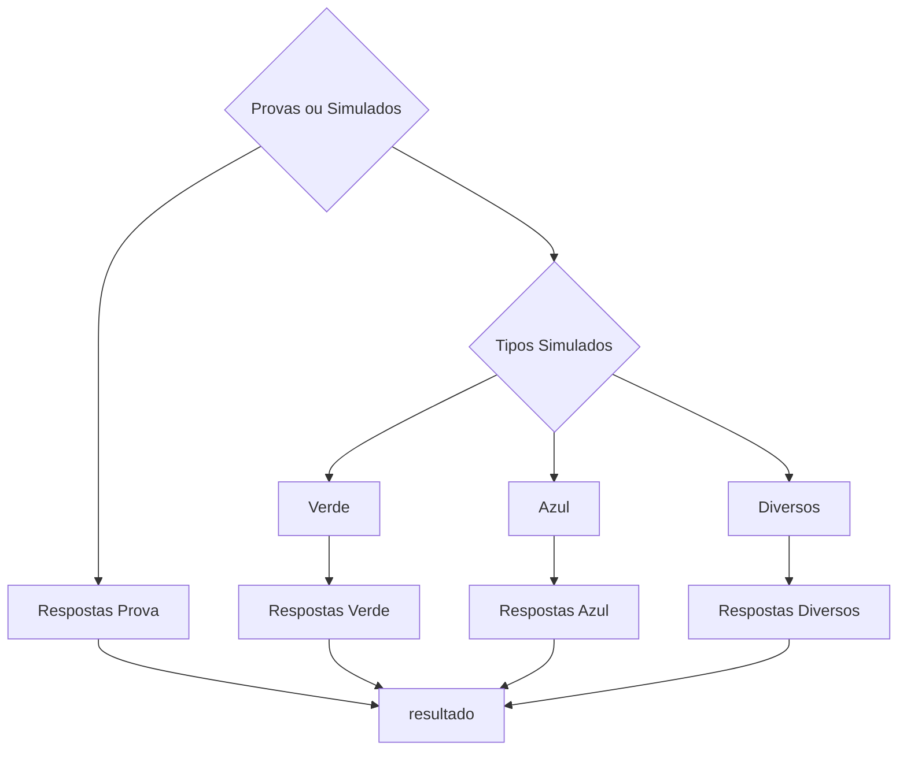
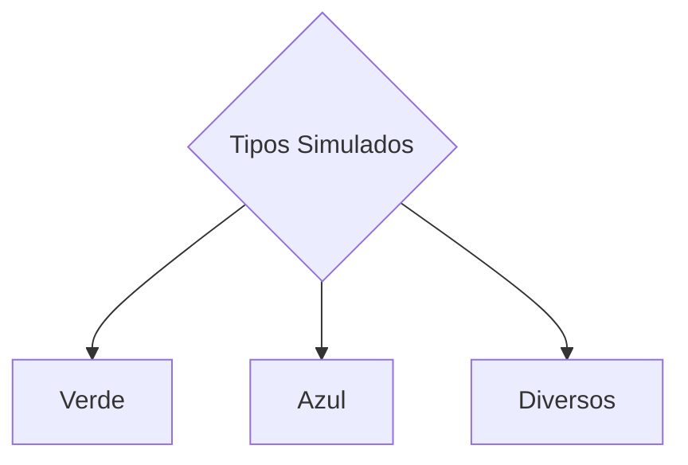
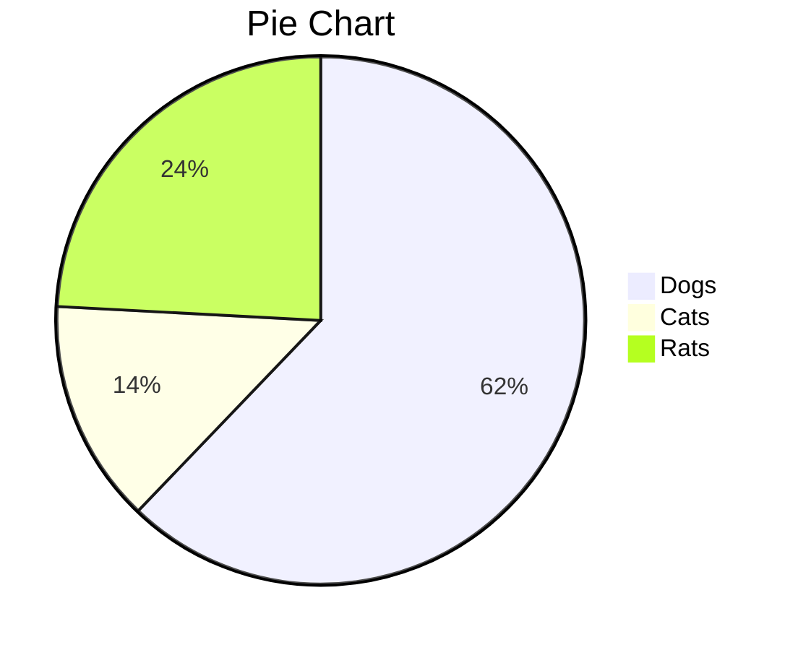

# Projeto de Classificação de Imagens para Detecção de Questões em Provas

Este projeto tem como objetivo a classificação e detecção de imagens de provas em dois tipos distintos: provas gabarito e provas simuladas. A classificação é realizada usando o modelo YOLOv8m-cls, que é uma versão do YOLO (You Only Look Once) otimizada para tarefas de classificação de objetos.

## Configuração do modelo de Classificação

### Parâmetros do Modelo

- **Tarefa (Task):** Classificação de imagens.
- **Modo (Mode):** Treinamento.
- **Modelo (Model):** YOLOv8m-cls.yaml
- **Dados (Data):** Diretório "/content/gdrive/MyDrive/simulados" contendo as imagens de treinamento.
- **Épocas (Epochs):** 300.
- **Paciência (Patience):** 50.
- **Tamanho do Lote (Batch):** 16.
- **Tamanho da Imagem (Imgsz):** 224 pixels.
  
## Fluxo do Projeto


1. **Pré-processamento de Imagens:** As imagens de provas são pré-processadas para o tamanho de imagem especificado (224x224 pixels).
2. **Treinamento do Modelo:** O modelo YOLOv8m-cls é treinado com as imagens de treinamento para classificar entre provas gabarito e provas simuladas.
3. **Classificação de Imagens:** Após o treinamento, o modelo é usado para classificar novas imagens como provas gabarito ou provas simuladas.


3. **subconjunto das imagens de simulado**
Caso a imagem for classificada como sendo uma do tipo simulado, ela será processada novamente agora para classificar a qual subconjunto das imagens de simulado ela pertence, visando assim atribuir a mesma um modelo otimizado para o seu tipo de prova, sendo estes o modelo para provas verdes o modelo para provas azul e o modelo para provas diversas que engloba uma variedade de provas com vários formatos diferentes. 



### Parâmetros do Modelo para o Tipo verde
- **Tarefa (Task):** detecção .
- **Modo (Mode):** Treinamento.
- **Modelo (Model):** yolov8m.yaml
- **Dados (Data):** Diretório "/content/gdrive/MyDrive/simulados" contendo as imagens de treinamento.
- **Épocas (Epochs):** 300.
- **Paciência (Patience):** 50.
- **Tamanho do Lote (Batch):** 16.
- **Tamanho da Imagem (Imgsz):** 640 pixels.

## Resultados do treinamento
<a target="_blank" align="center">
  
</a>


## matriz de confusão normalizada
<a target="_blank" align="center">
  
</a>
## Como Executar o Projeto

1. Clone este repositório:

```shell
git clone https://github.com/Daniel227a/desafio.git
```

<a target="_blank" align="center">
  
</a>
- Cool Stats on Laptop

- YouTube Logo Animation

<br><br>
<br><br>
<h3 align="left">Languages and Tools:</h3>
<p align="left"> <a href="https://git-scm.com/" target="_blank" rel="noreferrer">  </a> <a href="https://www.linux.org/" target="_blank" rel="noreferrer">  </a> <a href="https://nativescript.org/" target="_blank" rel="noreferrer">  </a> <a href="https://opencv.org/" target="_blank" rel="noreferrer">  </a> <a href="https://www.python.org" target="_blank" rel="noreferrer">  </a> <a href="https://www.tensorflow.org" target="_blank" rel="noreferrer">  </a> </p>

 <b>grow</b> and 
<b>excel</b> &nbsp.
# :man_technologist: Luiz Carlos Abbott Galvão Neto


📊 **This week I spent my time on** 

```text
⌚︎ Timezone: Asia/Calcutta

💬 Languages: 
JavaScript               5 hrs 36 mins       ███████░░░░░░░░░░░░░░░░░░   29.7% 
Python                   5 hrs 13 mins       ███████░░░░░░░░░░░░░░░░░░   27.69% 
PHP                      2 hrs 28 mins       ███░░░░░░░░░░░░░░░░░░░░░░   13.12% 
Markdown                 1 hr 58 mins        ██░░░░░░░░░░░░░░░░░░░░░░░   10.46% 
YAML                     1 hr 38 mins        ██░░░░░░░░░░░░░░░░░░░░░░░   8.74%

🔥 Editors: 
PyCharm                  8 hrs 35 mins       ███████████░░░░░░░░░░░░░░   45.55% 
WebStorm                 7 hrs 47 mins       ██████████░░░░░░░░░░░░░░░   41.33% 
PhpStorm                 2 hrs 28 mins       ███░░░░░░░░░░░░░░░░░░░░░░   13.12%
<h2 align="center"> That's all folks!</h2>
<p align="center">Raw version in the Markdown and reStructuredText format are available below</p>
💻 Operating Systems: 
Windows                  18 hrs 52 mins      █████████████████████████   100.0%

```
## Getting Started

The project might have multiple branches: `master`, `development`, etc. which can be explained here

* `master` contains aggregate code of all branches
* `development` contains code under development

Other details that need to be given while starting out with the project can be provided in this section. A project structure like below can also be included for the big projects:

```
	project-title
	├── README.md
	├── package.json
	├── .gitignore
	├── public
	│   ├── favicon.ico
	│   ├── index.html
	│   └── manifest.json
	└── src
		├── App.css
		├── App.js
		├── App.test.js
		├── index.css
		├── index.js
		├── logo.svg
		└── serviceWorker.js
		└── setupTests.js
```

#### 🤓 Check out my latest videos

<!-- YT LIST START -->
[](https://www.youtube.com/watch?v=z6qmP6JJvz8)
        **[Make your GitHub profile DYNAMIC using a Netlify (Lambda) Function](https://www.youtube.com/watch?v=z6qmP6JJvz8)**
        <br /> *13 Jul 2020*

[](https://www.youtube.com/watch?v=9JVE8OGRSlA)
        **[Let&#39;s build a high performance app using Recoil and React ](https://www.youtube.com/watch?v=9JVE8OGRSlA)**
        <br /> *07 Jul 2020*

[](https://www.youtube.com/watch?v=KBE7Ezn7h0A)
        **[Intro to Recoil - A great new Redux alternative? ](https://www.youtube.com/watch?v=KBE7Ezn7h0A)**
        <br /> *28 Jun 2020*

<!-- YT LIST END -->
<details open>
<summary>Install</summary>

Pip install the ultralytics package including all [requirements](https://github.com/ultralytics/ultralytics/blob/main/requirements.txt) in a [**Python>=3.8**](https://www.python.org/) environment with [**PyTorch>=1.8**](https://pytorch.org/get-started/locally/).

[](https://badge.fury.io/py/ultralytics) [](https://pepy.tech/project/ultralytics)

```bash
pip install ultralytics
```

For alternative installation methods including [Conda](https://anaconda.org/conda-forge/ultralytics), [Docker](https://hub.docker.com/r/ultralytics/ultralytics), and Git, please refer to the [Quickstart Guide](https://docs.ultralytics.com/quickstart).

</details>
## Roadmap

- [x] Add Changelog
- [x] Add back to top links
- [ ] Add Additional Templates w/ Examples
- [ ] Add "components" document to easily copy & paste sections of the readme
- [ ] Multi-language Support
    - [ ] Chinese
    - [ ] Spanish

# PROTÓTIPO DE SOLUÇÃO PARA CORREÇÃO AUTOMÁTICA DE PROVAS E SIMULADOS
Este projeto foi desenvolvido para o hackaton, produzido pela pixforce e meninas++, com o intuito de implementar um modelo capaz de ler gabaritos de provas e realizar a correção automática dos mesmos, auxiliando e agilizando este processo.

## Lógica de funcionamento do projeto
Inicialmente é implementado o algoritmo de detecção de objetos YOLOv8, com o intuito de receber uma imagem de gabarito e extrair o local de respoastas da folha. Em seguida partimos para identificar as bordas da saída do YOLOv8, tendo como objetivo organizar e identificar as repostas marcadas e por fim gerar um relátorio do desempenho do aluno na rpova em questão.

## Funcionalidades implementadas
- **Leitura das folhas de resposta**
- **Comparação e pontuação**

## 🚀Instalação
```
# Install the ultralytics package from PyPI
!pip install ultralytics
```

🚀
Para instalar o <nome_do_projeto>, siga estas etapas:

Linux e macOS:
```
<comando_de_instalação>
```
### Requirements

## Modo de uso
Adicione as imagens das provas na pasta nomeada como input, execute o notebook nomeado *main.ipynb* e o relatório estará disponivel no diretório output

## Bibliotecas utilizadas

## FAQ

## print do projeto

## 🤝 Colaboradores

Agradecemos às seguintes pessoas que contribuíram para este projeto:

<table>
  <tr>
    <td align="center">
      <a href="#">
        <br>
        <sub>
          <b>Daniel Pereira</b>
        </sub>
      </a>
    </td>
    <td align="center">
      <a href="#">
        <br>
        <sub>
          <b>Lucas Nardelli</b>
        </sub>
      </a>
    </td>
    <td align="center">
      <a href="#">
        <br>
        <sub>
          <b>Steve Jobs</b>
        </sub>
      </a>
    </td>
  </tr>
</table>
