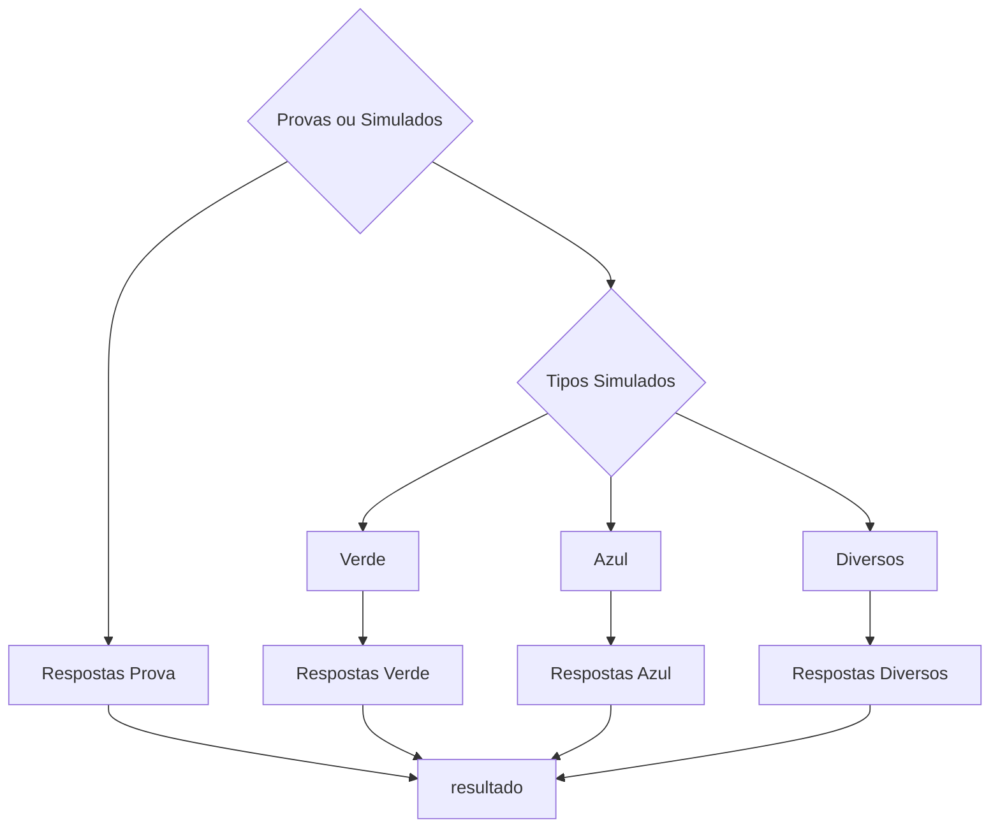

# Projeto de Automação para Correção  de Provas e Simulados Aplicando Técnicas de Visão Computacional

O projeto tem como objetivo o desenvolvimento de protótipo para automatizar o processo de leitura e correção de provas e simulados aplicando técnicas de visão computacional. Foram aplicadas técnicas de Classificação, Detecção, etc.

## Equipe Visão Pro
- Lucas Nardelli de Freitas Botelho Saar
- Daniel Pereira Monteiro
- Gabriel Sávio

## Fluxo do Projeto

Segue abaixo a descrição detalhada do fluxo do projeto:
1. **Submissão de Imagem de Entrada:**
   - O processo inicia com a submissão de uma imagem, que pode ser uma prova ou gabarito.

2. **Modelo de Classificação `YOLOv8m-cls` (1º Modelo):**
   - A imagem é submetida ao primeiro modelo de classificação, `YOLOv8m-cls`.
   - Este modelo classifica entre "Prova" ou "Simulado".

3. **Caso: Prova (Classificado pelo 1º Modelo):**
   - Se a imagem for classificada como "Prova", o fluxo continua para o próximo passo.

4. **Modelo de Detecção `YOLOv8m` (2º Modelo):**
   - A imagem (prova) é submetida ao segundo modelo de detecção, `YOLOv8m`.
   - Este modelo detecta e retorna a questão marcada pelo usuário como resposta.

5. **Caso: Simulado (Classificado pelo 1º Modelo):**
   - Se a imagem for classificada como "Simulado", o fluxo se desvia para outra sequência de modelos.

6. **Modelo de Classificação `YOLOv8m-cls` para Tipos de Simulados (3º Modelo):**
   - A imagem (simulado) é submetida a um terceiro modelo de classificação, `YOLOv8m-cls`.
   - Este modelo classifica entre os 3 formatos de simulados existentes.

7. **Modelo de Detecção `YOLOv8m` para Simulados (4º Modelo):**
   - A imagem (simulado) é passada para um quarto modelo de detecção, `YOLOv8m`.
   - Este modelo retorna as questões marcadas pelo aluno no simulado.

### Resumo:
- O projeto começa com a classificação da imagem como "Prova" ou "Simulado" usando o `YOLOv8m-cls`.
- Se for uma prova, é aplicado o `YOLOv8m` para detectar a questão marcada.
- Se for um simulado, é feita uma nova classificação para determinar o tipo de simulado usando outro modelo `YOLOv8m-cls`.
- Em seguida, um segundo modelo `YOLOv8m` é utilizado para detectar as questões marcadas no simulado.

### Ilustração do Fluxo


## Informações de Treinamento
### Ambiente
Todos os modelos foram treinados utilizando o Google Colab. O arquivo [`requirements.txt`](envs/requirements.txt) contém a lista de todas as bibliotecas e suas versões necessárias para este projeto. Certifique-se de que essas bibliotecas estejam instaladas em seu ambiente, caso queira repetir o treinamento.

### Modelos de Classificação

#### Modelo Provas ou Simulado

##### Parâmetros do Modelo

- **Tarefa (Task):** Classificação
- **Modo (Mode):** Treinamento
- **Modelo (Model):** YOLOv8m-cls.pt `pre-trained` 
- **Dados (Data):** Diretório "/content/gdrive/MyDrive/simulados" contendo as imagens de treinamento.
- **Épocas (Epochs):** 300.
- **Paciência (Patience):** 50.
- **Tamanho do Lote (Batch):** 16.
- **Tamanho da Imagem (Imgsz):** 224 pixels.
- **Aumento de Dados(Data Augmentation):** rotation: 5 and 10 degrees.

##### Resultados do Modelo de Prova ou Simulado

<div style="display: flex; justify-content: space-between;">
  <a target="_blank" align="center">
    
  </a>
  <a target="_blank" align="center">
    
  </a>
</div>

#### Modelo dos Simulados

##### Parâmetros do Modelo

- **Tarefa (Task):** Classificação
- **Modo (Mode):** Treinamento
- **Modelo (Model):** YOLOv8m-cls.pt `pre-trained`
- **Dados (Data):** Diretório "/content/gdrive/MyDrive/simulados" contendo as imagens de treinamento.
- **Épocas (Epochs):** 300.
- **Paciência (Patience):** 50.
- **Tamanho do Lote (Batch):** 16.
- **Tamanho da Imagem (Imgsz):** 224 pixels.
- **Aumento de Dados(Data Augmentation):** rotation: 5 and 10 degrees.
##### Resultados do Modelo de Prova ou Simulado

<div style="display: flex; justify-content: space-between;">
  <a target="_blank" align="center">
    
  </a>
  <a target="_blank" align="center">
    
  </a>
</div>

### Modelos de Detecção

#### Parâmetros do Modelo de Provas
- **Tarefa (Task):** detecção 
- **Modo (Mode):** Treinamento
- **Modelo (Model):** yolov8m.pt `pre-trained`
- **Dados (Data):** Diretório "/content/gdrive/MyDrive/simulados" contendo as imagens de treinamento.
- **Épocas (Epochs):** 300.
- **Paciência (Patience):** 50.
- **Tamanho do Lote (Batch):** 16.
- **Tamanho da Imagem (Imgsz):** 640 pixels.

#### Resultados do Modelo de Provas
<div style="display: flex; justify-content: space-between;">
  <a target="_blank" align="center">
    
  </a>
  <a target="_blank" align="center">
    
  </a>
</div>

#### Parâmetros do Modelo para o Tipo verde
- **Tarefa (Task):** detecção 
- **Modo (Mode):** Treinamento
- **Modelo (Model):** yolov8m.pt `pre-trained`
- **Dados (Data):** Diretório "/content/gdrive/MyDrive/simulados" contendo as imagens de treinamento.
- **Épocas (Epochs):** 300.
- **Paciência (Patience):** 50.
- **Tamanho do Lote (Batch):** 16.
- **Tamanho da Imagem (Imgsz):** 640 pixels.
- **Aumento de Dados(Data Augmentation):** rotation: 5 and 10 degrees.

#### Resultados do Modelo para o Tipo verde

<div style="display: flex; justify-content: space-between;">
  <a target="_blank" align="center">
    
  </a>
  <a target="_blank" align="center">
    
  </a>
</div>

#### Parâmetros do Modelo para o Tipo Azul
- **Tarefa (Task):** detecção 
- **Modo (Mode):** Treinamento
- **Modelo (Model):** yolov8m.pt `pre-trained`
- **Épocas (Epochs):** 300.
- **Paciência (Patience):** 50.
- **Tamanho do Lote (Batch):** 16.
- **Tamanho da Imagem (Imgsz):** 640 pixels.
- **Aumento de Dados(Data Augmentation):** rotation: 5 and 10 degrees.
  
#### Resultados do Modelo para o Tipo Azul

<div style="display: flex; justify-content: space-between;">
  <a target="_blank" align="center">
    
  </a>
  <a target="_blank" align="center">
    
  </a>
</div>

#### Parâmetros do Modelo para o Tipo Diversos
- **Tarefa (Task):** detecção 
- **Modo (Mode):** Treinamento
- **Modelo (Model):** yolov8m.pt `pre-trained`
- **Épocas (Epochs):** 150.
- **Paciência (Patience):** 50.
- **Tamanho do Lote (Batch):** 16.
- **Tamanho da Imagem (Imgsz):** 640 pixels.
- **Aumento de Dados(Data Augmentation):** rotation: 5 and 10 degrees.

#### Resultados do Modelo para o Tipo Diversos

<div style="display: flex; justify-content: space-between;">
  <a target="_blank" align="center">
    
  </a>
  <a target="_blank" align="center">
    
  </a>
</div>


## :man_technologist: Soluções e Resultados
### Mobile
Para a criação da solução móvel, optamos pelo framework React Native, visando proporcionar uma experiência intuitiva por meio de uma interface amigável.

<p align="center">
  
  
</p>

<p align="center">
  
  
</p>


### Desktop
Para a solução desktop foi desenvolvida uma interface utilzando python com a biblioteca `tkinter`, para demosntrar o funcionamento da solução.

<a target="_blank" align="center">
  
</a>

<div style="display: flex; justify-content: space-between;">
  <a target="_blank" align="center">
    
  </a>
  <a target="_blank" align="center">
    
  </a>
</div>

	
## Como Executar o Projeto Localmente

1. **Clone este repositório:**

   ```shell
   git clone https://github.com/Daniel227a/desafio.git
   ```

2. **Baixe os modelos treinados e insira no diretório "modelos":**

   - [Google Drive - Modelos Treinados](https://drive.google.com/drive/folders/150vCXrseNIn_qCshArFYYRjI4ODhuXoW?usp=sharing)

3. **Instale o Anaconda:**

   Se você ainda não tem o Anaconda instalado, você pode baixá-lo [aqui](https://www.anaconda.com/products/distribution) e seguir as instruções de instalação apropriadas para o seu sistema operacional.

4. **Crie um Ambiente Conda:**

   No terminal ou Anaconda Prompt, navegue até o diretório do projeto e execute:

   ```shell
   conda env create -f environment.yml
   ```

   Isso criará um ambiente conda chamado "hackaton-env" com as dependências necessárias.

5. **Ative o Ambiente Conda:**

   ```shell
   conda activate hackaton-env
   ```
6. **Execute o Jupyter Notebook:**

   ```shell
   jupyter-notebook
   ```

7. **Abra o Arquivo "Hackaton.ipynb":**

   Dentro do Jupyter Notebook, abra o arquivo "Hackaton.ipynb" para visualizar e executar o projeto.
   
   **Observação:** Certifique-se de que o ambiente conda "hackaton-env" está ativado enquanto você executa o Jupyter Notebook.
   
   Isso deve permitir que você execute o projeto em seu ambiente local. Certifique-se de ter todas as dependências instaladas e os modelos treinados disponíveis no diretório apropriado.


## Demostração da Solução


#### 🤓 Youtube Videos

<!-- YT LIST START -->
[](https://www.youtube.com/watch?v=Y9e7IOETqfY&ab_channel=LucasSaar)
        **[Apresentação do Projeto](https://www.youtube.com/watch?v=Y9e7IOETqfY&ab_channel=LucasSaar)**
        <br /> *14 Nov 2023*

 <br> <br/>
 
[](https://www.youtube.com/watch?v=z2mVkziLjvI&ab_channel=LucasSaar)
        **[Solução Google Colab](https://www.youtube.com/watch?v=z2mVkziLjvI&ab_channel=LucasSaar)**
        <br /> *14 Nov 2023*

 <br> <br/>
 
[](https://www.youtube.com/shorts/cMPvLL2T7ws)
        **[Solução Aplicativo Mobile](https://www.youtube.com/shorts/cMPvLL2T7ws)**
        <br /> *14 Nov 2023*

<br> <br/>
 
[](https://www.youtube.com/watch?v=lnIQJr3Ktjw&ab_channel=LucasSaar)
        **[Solução Desktop](https://www.youtube.com/watch?v=lnIQJr3Ktjw&ab_channel=LucasSaar)**
        <br /> *14 Nov 2023*

<br> <br/>

## 🤝 Colaboradores
<table>
  <tr>
    <td align="center">
      <a href="https://github.com/Daniel227a" target="_blank">
        <br>
        <sub>
          <b>Daniel Pereira</b>
        </sub>
      </a>
    </td>
    <td align="center">
      <a href="https://github.com/lucasnardelli" target="_blank">
        <br>
        <sub>
          <b>Lucas Nardelli</b>
        </sub>
      </a>
    </td>
    <td align="center">
      <a href="https://github.com/gslmota" target="_blank">
        <br>
        <sub>
          <b>Gabriel Mota</b>
        </sub>
      </a>
    </td>
  </tr>
</table>

