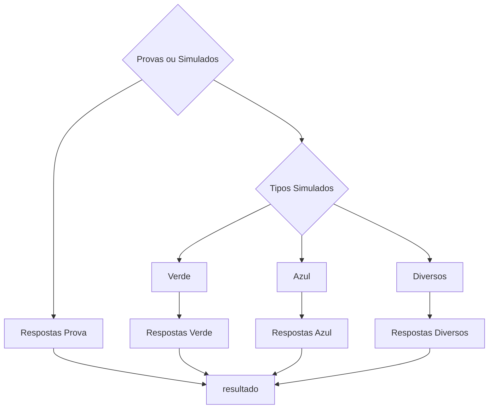
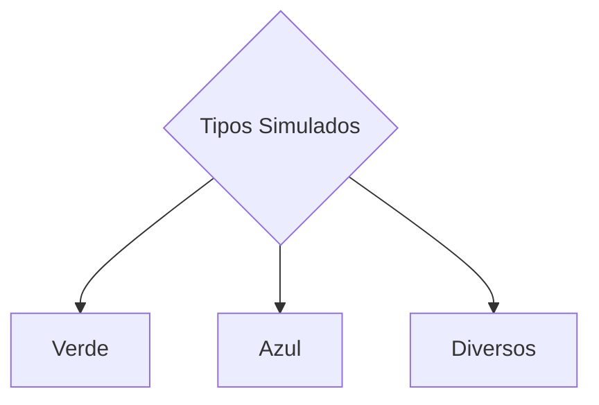

# Projeto de Classificação de Imagens para Detecção de Questões em Provas 


Este projeto tem como objetivo a classificação e detecção de imagens de provas em dois tipos distintos: provas gabarito e provas simuladas. A classificação é realizada usando o modelo YOLOv8m-cls, que é uma versão do YOLO (You Only Look Once) otimizada para tarefas de classificação de objetos.  

## Soluções Mobile
<a target="_blank" align="center">
  
  
</a>


<a target="_blank" align="center" >
  
  
</a>


## Soluções Para windows

<a target="_blank" align="center">
  
</a>


  
## Fluxo do Projeto



1. **Pré-processamento de Imagens:** As imagens de provas são pré-processadas para o tamanho de imagem especificado (224x224 pixels).
2. **Treinamento do Modelo:** O modelo YOLOv8m-cls é treinado com as imagens de treinamento para classificar entre provas gabarito e provas simuladas.
3. **Classificação de Imagens:** Após o treinamento, o modelo é usado para classificar novas imagens como provas gabarito ou provas simuladas.


3. **subconjunto das imagens de simulado**
Caso a imagem for classificada como sendo uma do tipo simulado, ela será processada novamente agora para classificar a qual subconjunto das imagens de simulado ela pertence, visando assim atribuir a mesma um modelo otimizado para o seu tipo de prova, sendo estes o modelo para provas verdes o modelo para provas azul e o modelo para provas diversas que engloba uma variedade de provas com vários formatos diferentes. 



## Configuração do modelo 

### Parâmetros do Modelo

- **Tarefa (Task):** Classificação de imagens.
- **Modo (Mode):** Treinamento.
- **Modelo (Model):** YOLOv8m-cls.yaml
- **Dados (Data):** Diretório "/content/gdrive/MyDrive/simulados" contendo as imagens de treinamento.
- **Épocas (Epochs):** 300.
- **Paciência (Patience):** 50.
- **Tamanho do Lote (Batch):** 16.
- **Tamanho da Imagem (Imgsz):** 224 pixels.

### Parâmetros do Modelo para o Tipo verde
- **Tarefa (Task):** detecção .
- **Modo (Mode):** Treinamento.
- **Modelo (Model):** yolov8m.yaml
- **Dados (Data):** Diretório "/content/gdrive/MyDrive/simulados" contendo as imagens de treinamento.
- **Épocas (Epochs):** 300.
- **Paciência (Patience):** 50.
- **Tamanho do Lote (Batch):** 16.
- **Tamanho da Imagem (Imgsz):** 640 pixels.
- 
- ### Parâmetros do Modelo para o Tipo Azul
- **Tarefa (Task):** detecção .
- **Modo (Mode):** Treinamento.
- **Modelo (Model):** yolov8m.yaml
- **Épocas (Epochs):** 300.
- **Paciência (Patience):** 50.
- **Tamanho do Lote (Batch):** 16.
- **Tamanho da Imagem (Imgsz):** 640 pixels.
  
### Parâmetros do Modelo para o Tipo Diversos
- **Tarefa (Task):** detecção .
- **Modo (Mode):** Treinamento.
- **Modelo (Model):** yolov8m.yaml
- **Épocas (Epochs):** 150.
- **Paciência (Patience):** 50.
- **Tamanho do Lote (Batch):** 16.
- **Tamanho da Imagem (Imgsz):** 640 pixels.


## Resultados do treinamento 

## Resultados do treinamento Modelo verde
<a target="_blank" align="center">
  
</a>


## matriz de confusão normalizada  Modelo verde
<a target="_blank" align="center">
  
</a>


## Resultados do treinamento Modelo azul
<a target="_blank" align="center">
  
</a>


## matriz de confusão normalizada Modelo azul
<a target="_blank" align="center">
  
</a>

## Resultados do treinamento Modelo diversos
<a target="_blank" align="center">
  
</a>

## matriz de confusão normalizada Modelo diversos
<a target="_blank" align="center">
  
</a>


# :man_technologist: Resultados

<a target="_blank" align="center">
  
<a target="_blank" align="center">
  
</a>
	

## Como Executar o Projeto
<a target="_blank" align="center">
  
</a>

1. Clone este repositório:

```shell
git clone https://github.com/Daniel227a/desafio.git
```
2. Baixe os medelos treinados e insira no diretorio modelos
   
```shell
https://drive.google.com/drive/folders/150vCXrseNIn_qCshArFYYRjI4ODhuXoW?usp=sharing
```
3. Execute o jupyter
```shell
jupyter-notebook
```
4. Abra o arquivo
```shell
Hackaton.ipynb
```
- YouTube Logo Animation


#### 🤓 Check out my latest videos

<!-- YT LIST START -->
[](https://www.youtube.com/watch?v=z6qmP6JJvz8)
        **[Make your GitHub profile DYNAMIC using a Netlify (Lambda) Function](https://www.youtube.com/watch?v=z6qmP6JJvz8)**
        <br /> *13 Jul 2020*


## 🤝 Colaboradores
<table>
  <tr>
    <td align="center">
      <a href="#">
        <br>
        <sub>
          <b>Daniel Pereira</b>
        </sub>
      </a>
    </td>
    <td align="center">
      <a href="#">
        <br>
        <sub>
          <b>Lucas Nardelli</b>
        </sub>
      </a>
    </td>
    <td align="center">
      <a href="#">
        <br>
        <sub>
          <b>Gabriel Mota</b>
        </sub>
      </a>
    </td>
  </tr>
</table>
